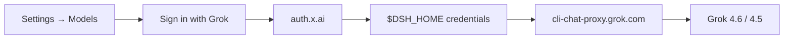

<p align="center">
  
</p>

<h1 align="center">dsh-llm-grok-oauth</h1>

<p align="center">
  <strong>Sign in with Grok</strong> on the Models page.<br>
  SuperGrok / X Premium+ in <a href="https://github.com/deepseek-ai/deepseek-harness">DeepSeek Harness</a> — no xAI API key.
</p>

<p align="center">
  English · <a href="README.md">简体中文</a>
</p>

<p align="center">
  <a href="https://github.com/topics/dsh-plugin"></a>
  <a href="https://github.com/wangyaominde/dsh-llm-grok-oauth/stargazers"></a>
  <a href="LICENSE"></a>
  <a href="https://github.com/deepseek-ai/deepseek-harness"></a>
  
</p>

---

DeepSeek Harness already knows how to take an API key. This plugin adds the piece it does not have: **one-click Grok subscription login**, living on the Grok card in **Settings → Models**.

<p align="center">
  
</p>
<p align="center">
  <sub>Settings → Models → <b>Grok (xAI 订阅)</b> · login stays on this row</sub>
</p>

Open that card, click **使用 Grok 账号登录**, finish the xAI prompt, then pick Grok 4.6 / 4.5 in the composer. SuperGrok or X Premium+ is enough. No extra settings page. No plugin-tab detour.

## Features

<table>
  <tr>
    <td width="50%">
      <h3>🔐 One-click login</h3>
      Portaled onto the Grok provider row. Device-code flow (RFC 8628); the host opens the browser, the card shows the confirmation code.
    </td>
    <td width="50%">
      <h3>🎫 Subscription, not billing</h3>
      Same first-party OAuth client and chat proxy the official Grok CLI uses. You pay with SuperGrok / X Premium+, not API credits.
    </td>
  </tr>
  <tr>
    <td>
      <h3>📡 Live catalog</h3>
      After login, entitled models appear in the harness picker. Hidden catalog entries stay off unless you opt in.
    </td>
    <td>
      <h3>🌊 Streaming that fits dsh</h3>
      Responses / chat-completions → <code>StreamChunk</code>, including reasoning, tools, and usage.
    </td>
  </tr>
  <tr>
    <td>
      <h3>💾 Tokens stay local</h3>
      Written to the harness credential store (<code>GROK_OAUTH_TOKENS</code>). The UI never prints them.
    </td>
    <td>
      <h3>♻️ Reuses Grok CLI</h3>
      If <code>~/.grok/auth.json</code> is already signed in for the same client, login reuses that session.
    </td>
  </tr>
</table>

## Install

```sh
dsh plugin --profile web add github:wangyaominde/dsh-llm-grok-oauth
```

Restart `dsh web`. That is the whole setup.

| Need | |
| --- | --- |
| DeepSeek Harness `0.1.0-rc.6`+ | required |
| SuperGrok or X Premium+ | required |
| Official Grok CLI | optional |
| xAI API key | not used |

## Usage

1. Open **Settings → Models**.
2. On **Grok (xAI 订阅)**, click **使用 Grok 账号登录** / **Sign in with Grok**.
3. Confirm the code in the browser window that opens.
4. Back in a session, select **Grok (xAI 订阅)** and start chatting.

Sign-out is on the same card. Token refresh is automatic.

## How it works



This plugin does **not** call `api.x.ai` and does **not** write `GROK_API_KEY`. Built-in API-key Grok (if you already configured it) stays untouched.

## This plugin vs an API key

| | This plugin | Pasting an xAI key |
| --- | --- | --- |
| Where | Settings → Models | Settings → Models (built-in) |
| You pay with | Grok subscription | API credits |
| Extra page | none | none |
| What this repo adds | OAuth login + subscription route | already in dsh |

## Uninstall

```sh
dsh plugin --profile web remove dsh-llm-grok-oauth
```

Restart `dsh web` afterwards.

## License

[MIT](LICENSE) © wangyaominde
