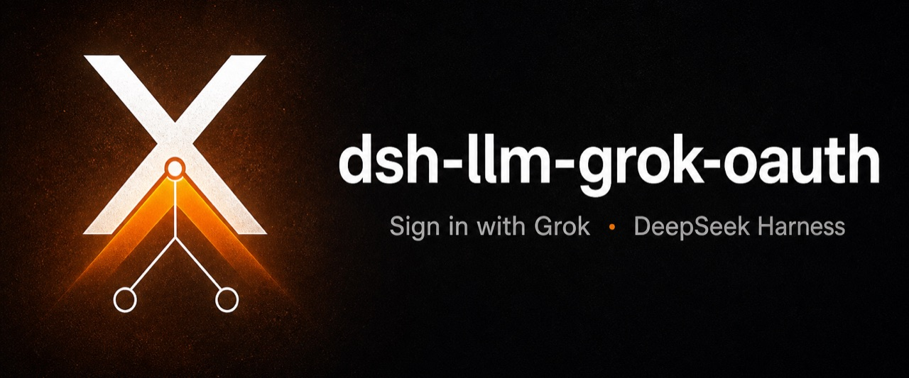
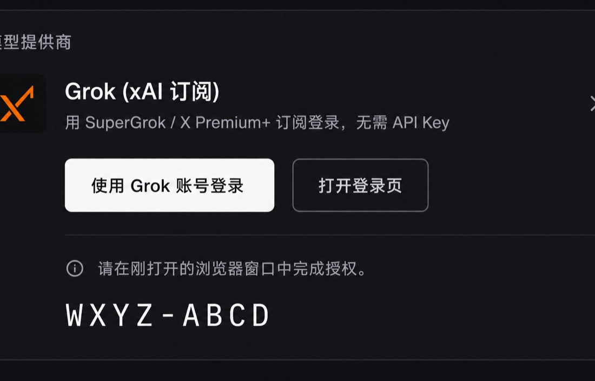
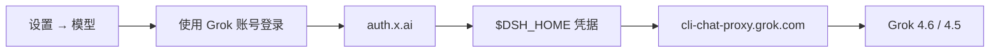

<p align="center">
  
</p>

<h1 align="center">dsh-llm-grok-oauth</h1>

<p align="center">
  在模型页 <strong>使用 Grok 账号登录</strong>。<br>
  把 SuperGrok / X Premium+ 接到 <a href="https://github.com/deepseek-ai/deepseek-harness">DeepSeek Harness</a>，不需要 xAI API Key。
</p>

<p align="center">
  <a href="README.en.md">English</a> · 简体中文
</p>

<p align="center">
  <a href="https://github.com/topics/dsh-plugin"></a>
  <a href="https://github.com/wangyaominde/dsh-llm-grok-oauth/stargazers"></a>
  <a href="LICENSE"></a>
  <a href="https://github.com/deepseek-ai/deepseek-harness"></a>
  
</p>

---

DeepSeek Harness 本来就会填 API Key。这个插件只补它没有的能力：在 **设置 → 模型** 的 Grok 卡片上 **一键登录订阅**。

<p align="center">
  
</p>
<p align="center">
  <sub>设置 → 模型 → <b>Grok (xAI 订阅)</b> · 登录就做在这一行</sub>
</p>

打开这张卡片，点 **使用 Grok 账号登录**，在 xAI 授权页确认，回到会话选 Grok 4.6 / 4.5 即可。有 SuperGrok 或 X Premium+ 就行，不另开设置页，也不走插件页。

## 能做什么

<table>
  <tr>
    <td width="50%">
      <h3>🔐 一键登录</h3>
      嵌在 Grok 提供方那一行。设备码流程（RFC 8628）；宿主打开浏览器，卡片上显示确认代码。
    </td>
    <td width="50%">
      <h3>🎫 走订阅，不走账单</h3>
      与官方 Grok CLI 同一套第一方 OAuth 客户端和聊天代理。用 SuperGrok / X Premium+，不用 API 余额。
    </td>
  </tr>
  <tr>
    <td>
      <h3>📡 实时目录</h3>
      登录后，账号可用的模型出现在选择器里。目录里标成隐藏的默认不展示。
    </td>
    <td>
      <h3>🌊 对接 dsh 流协议</h3>
      Responses / chat-completions 译成 <code>StreamChunk</code>，含推理、工具和用量。
    </td>
  </tr>
  <tr>
    <td>
      <h3>💾 令牌留在本机</h3>
      写入 harness 凭据存储（<code>GROK_OAUTH_TOKENS</code>），界面不回显。
    </td>
    <td>
      <h3>♻️ 复用 Grok CLI</h3>
      若 <code>~/.grok/auth.json</code> 已用同一客户端登录，会直接复用那份会话。
    </td>
  </tr>
</table>

## 安装

```sh
dsh plugin --profile web add github:wangyaominde/dsh-llm-grok-oauth
```

重启 `dsh web`。没有第二步。

| 需要 | |
| --- | --- |
| DeepSeek Harness `0.1.0-rc.6` 及以上 | 必须 |
| SuperGrok 或 X Premium+ | 必须 |
| 官方 Grok CLI | 可选 |
| xAI API Key | 不用 |

## 怎么用

1. 打开 **设置 → 模型**。
2. 在 **Grok (xAI 订阅)** 上点 **使用 Grok 账号登录**。
3. 在弹出的浏览器里确认代码。
4. 回到会话，选择 **Grok (xAI 订阅)**，直接聊。

退出登录也在同一张卡片。令牌过期会自动刷新。

## 怎么走



这个插件 **不请求** `api.x.ai`，也 **不写入** `GROK_API_KEY`。你已经在 dsh 里配过的 API Key 线路不会被改掉。

## 和填 API Key 的区别

| | 这个插件 | 粘贴 xAI Key |
| --- | --- | --- |
| 在哪配置 | 设置 → 模型 | 设置 → 模型（dsh 自带） |
| 用什么额度 | Grok 订阅 | API 余额 |
| 额外页面 | 没有 | 没有 |
| 本仓库补的 | OAuth 登录 + 订阅线路 | dsh 已经有了 |

## 卸载

```sh
dsh plugin --profile web remove dsh-llm-grok-oauth
```

然后重启 `dsh web`。

## 许可

[MIT](LICENSE) © wangyaominde
